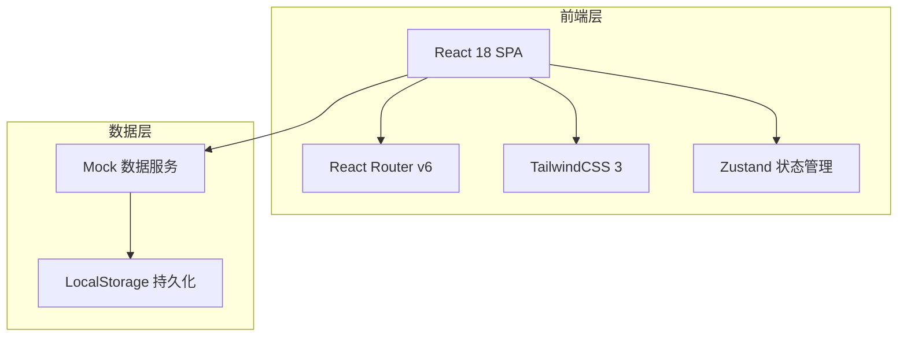
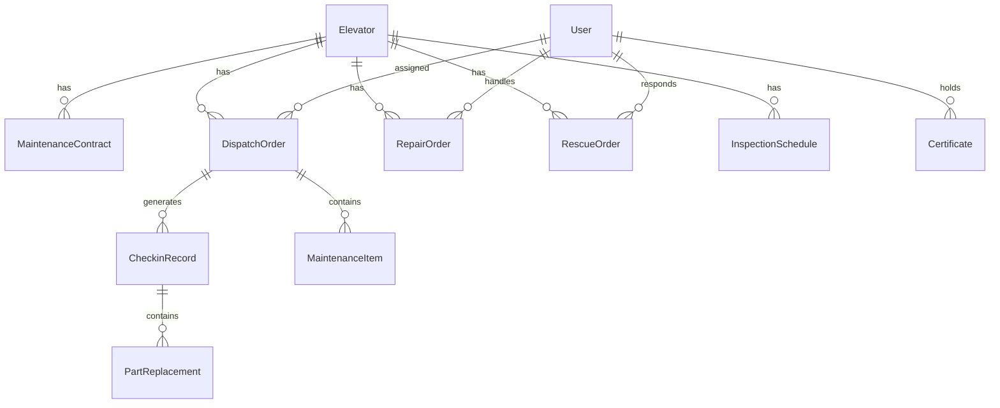

## 1. 架构设计



## 2. 技术说明

- **前端框架**：React@18 + TypeScript
- **构建工具**：Vite
- **样式方案**：TailwindCSS@3
- **路由**：React Router v6
- **状态管理**：Zustand（轻量级，适合移动端APP）
- **图表库**：Recharts（完成率统计、趋势分析）
- **图标库**：Lucide React（线性图标风格统一）
- **后端服务**：无后端，使用Mock数据 + LocalStorage持久化
- **数据库**：前端Mock数据，LocalStorage存储用户操作状态

## 3. 路由定义

| 路由 | 用途 |
|------|------|
| `/login` | 登录页面 |
| `/` | 首页工作台 |
| `/elevators` | 电梯台账列表 |
| `/elevators/:id` | 电梯详情 |
| `/elevators/:id/disable` | 电梯停用挂牌 |
| `/contracts` | 合同到期提醒 |
| `/dispatch` | 维保派工列表 |
| `/dispatch/:id` | 派工详情 |
| `/certificates` | 人员持证管理 |
| `/checkin` | 保养扫码打卡 |
| `/checkin/:id/items` | 保养项目确认 |
| `/checkin/:id/parts` | 零部件更换记录 |
| `/repair` | 故障报修列表 |
| `/repair/new` | 新建报修工单 |
| `/repair/:id` | 报修工单详情/跟踪 |
| `/rescue` | 困人救援列表 |
| `/rescue/:id` | 救援工单详情+到场计时 |
| `/rescue/:id/record` | 救援记录 |
| `/inspection` | 年检排期 |
| `/inspection/new` | 年检录入 |
| `/stats` | 绩效统计 |
| `/profile` | 个人中心 |
| `/notifications` | 消息通知 |

## 4. API定义

本项目不使用后端服务，所有数据通过Mock数据层提供。定义以下数据接口：

```typescript
interface Elevator {
  id: string
  code: string
  address: string
  community: string
  brand: string
  model: string
  floorCount: number
  status: "normal" | "maintenance" | "fault" | "disabled"
  contractExpiry: string
  lastMaintenance: string
  nextInspection: string
  disabledReason?: string
  disabledAt?: string
}

interface MaintenanceContract {
  id: string
  elevatorId: string
  companyName: string
  startDate: string
  endDate: string
  type: "half_monthly" | "quarterly"
  status: "active" | "expiring" | "expired"
}

interface DispatchOrder {
  id: string
  elevatorId: string
  type: "half_monthly" | "quarterly" | "repair"
  status: "pending" | "accepted" | "in_progress" | "completed"
  assigneeId: string
  assigneeName: string
  scheduledDate: string
  createdAt: string
  completedAt?: string
  items: MaintenanceItem[]
}

interface MaintenanceItem {
  id: string
  name: string
  category: string
  checked: boolean
  remark?: string
  photos?: string[]
}

interface CheckinRecord {
  id: string
  dispatchId: string
  elevatorId: string
  checkinTime: string
  checkinLocation: string
  checkoutTime?: string
  items: MaintenanceItem[]
  parts: PartReplacement[]
}

interface PartReplacement {
  id: string
  name: string
  model: string
  quantity: number
  photos: string[]
  replacedAt: string
}

interface RepairOrder {
  id: string
  elevatorId: string
  faultType: string
  faultDesc: string
  urgency: "low" | "medium" | "high"
  photos: string[]
  status: "submitted" | "assigned" | "repairing" | "completed"
  reporterId: string
  reporterName: string
  assigneeId?: string
  assigneeName?: string
  createdAt: string
  completedAt?: string
  timeline: RepairTimeline[]
}

interface RepairTimeline {
  time: string
  action: string
  operator: string
  remark?: string
}

interface RescueOrder {
  id: string
  elevatorId: string
  trappedFloor: number
  trappedCount: number
  elevatorStatus: string
  status: "dispatched" | "en_route" | "arrived" | "rescued" | "closed"
  assigneeId: string
  assigneeName: string
  createdAt: string
  arrivedAt?: string
  rescuedAt?: string
  closedAt?: string
  responseMinutes?: number
  rescueRecord?: RescueRecord
}

interface RescueRecord {
  cause: string
  process: string
  result: string
  photos: string[]
}

interface InspectionSchedule {
  id: string
  elevatorId: string
  type: "annual" | "periodic"
  scheduledDate: string
  status: "pending" | "overdue" | "completed"
  result?: "pass" | "fail"
  nextDate?: string
  reportAttachment?: string
}

interface Certificate {
  id: string
  userId: string
  userName: string
  certType: string
  certNumber: string
  issueDate: string
  expiryDate: string
  status: "valid" | "expiring" | "expired"
}

interface User {
  id: string
  name: string
  phone: string
  role: "admin" | "dispatcher" | "worker"
  avatar: string
  certificates: Certificate[]
}

interface PerformanceStats {
  workerId: string
  workerName: string
  monthlyCompleted: number
  monthlyTotal: number
  completionRate: number
  avgResponseMinutes: number
  rescueCount: number
}
```

## 5. 服务器架构图

不适用（无后端服务）

## 6. 数据模型

### 6.1 数据模型定义



### 6.2 数据定义语言

本项目使用前端Mock数据，数据存储于LocalStorage中，初始数据通过Seed脚本写入。

主要数据集合：
- `elevators` - 电梯设备列表
- `contracts` - 维保合同列表
- `dispatch_orders` - 派工工单
- `checkin_records` - 打卡记录
- `part_replacements` - 零部件更换记录
- `repair_orders` - 报修工单
- `rescue_orders` - 救援工单
- `inspections` - 年检排期
- `users` - 用户信息
- `certificates` - 证书信息
- `performance_stats` - 绩效数据
